# tuner
remote control for different antenna tuners

Yaesu FC-1000 / FC-800
started with buying a Yaesu Automatic Antenna Tuner FC-1000 w/o control unit. I started with removing the existing controller and thought about to do a replacement with an atmega328p in combination with 3 HC595 shift register. Interface to a laptop pc via uart. I had this setup running (328p firmware in C). But after working with RF24 modules I decided to do the interface wireless. 328p is no longer required but the 595 board can be used.The 3 HC595 are connected via wires and DSUB9 connector to an externel arduino with RF24 module. I wrote a python script with slider and radio buttons. Best band settings were programmed to radio buttons of the script. Later I found out, that my FT-840 has a controller included and I only need to have a cable... But the new setup is more flexible and can be used with any transceiver. 

LDG AT-1000 (2003)
is a asymmetric low-pass 1kW antenna tuner with manual control. Automatic does not really work well and the tuner had some issues with internal EMC. But in general it has good L and C components an uses an Allegro 5832 to control the 15 relays. Allegro 5832 has an 3-wire interface similar to SPI (data, clock, strobe). Some housings have a hole for D-SUB9 connector, but I have not found an controller option. I have have removed the connection between 68HC11 and 5832 (chokes L11, L12 and L13) and connected 5832 with wires to a DSUB9 connector (data, clock, strobe, gnd, 12V). 

Christian Koppler (DL3LAC)
is a symmetric antenna coupler. The main unit contains only L, C and relays and will be controlled with a control unit via a 25-wire cable (16 pins for relays, 7 pins for 12V, 2 pins spare). I have created an interface board with TI TPIC6A595 driver 2s (2p for inductor relays) and 5V Supply. A arduino uno with rf24 will be connected to this interface for receiving control data from the rf24 transmitter.

The RF24 transmitter will be the same for all 3 antenna tuners. The RF24 receivers are different for each tuner because the tuner hardware (serial interface) is different. It is not required to build up 3 receiver but a dedicated receiver for each tuner helps to keep the overview.  

Software is written very straight forward (no error correction / udp style). GUI does not show the real state after start (only after pushing the button). After start you have to press all off button to set everything to zero/off.Terminal shows the output sequence. 

Additional interface hardware is required for Yaesu and Christian Koppler. The schematics for the Yaesu tuner has an wrong order for the relays connected to pin 12 to 19 (RL11,10,9,8,7,6,5,1_2 would be better). Later I have fixed that mistake with jumper wires. In between I have used a python script with LUT to do the correction  but correction in hardware makes programming easier. U1 of the Christian Koppler interface needs a 2nd TPIC6A595 on top (all pins connected except pin18 (nc)) because current output of a single chip is too weak for driving 4 relays in parallel. The board of the LDG Tuner has already the Allegro 5832 shift-register which can directly connected to the external arduino. 

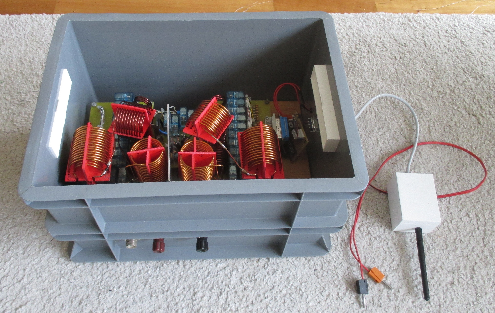

#### Christian Koppler with remote receiver (Arduino with RF24 module)
- this euro box can be put in the backyard to connect the antenna
- 12V from VRLA battery is required

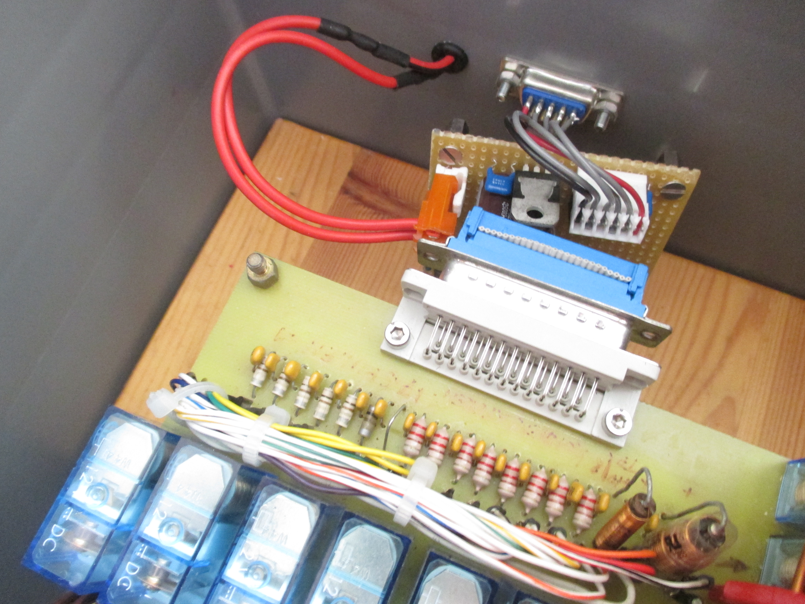

#### Interface inside the housing
- interface female DSUB25
- tuner male DSUB25

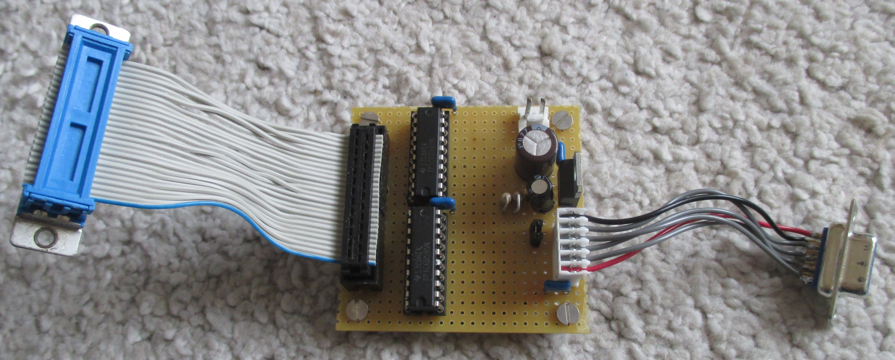

#### Interface board for Christian Koppler
- with 5V supply fot TPIC6B595 components
- 2nd 6B595 is soldered on top of U1 (pin 18 not connected)

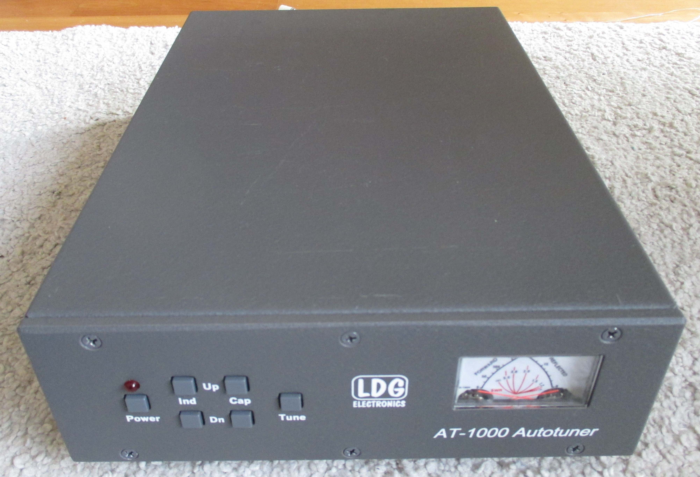

#### LDG AT-1000 Tuner
- front view

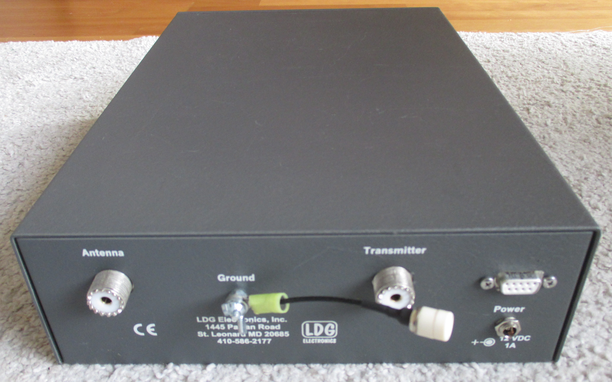

#### LDG AT-1000 Tuner
- rear view

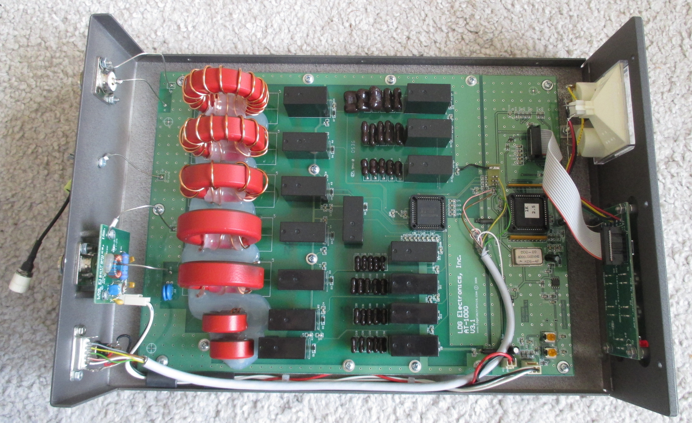

#### LDG AT-1000 Tuner
- top view
- see wiring to connect Allegro 5832

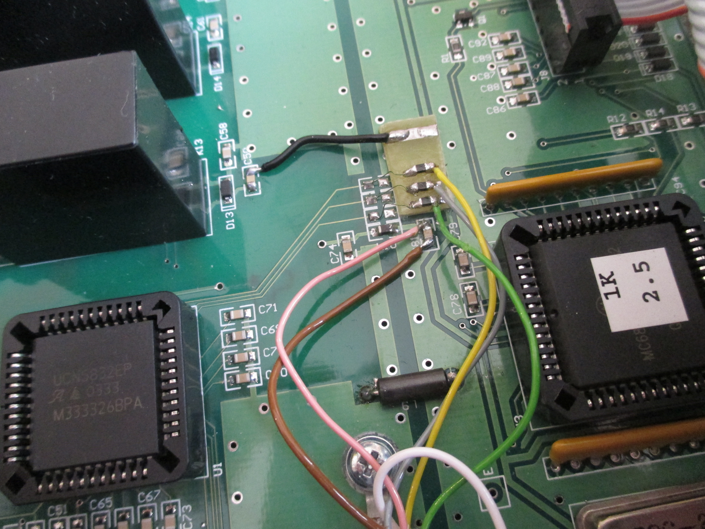

#### LDG AT-1000 Tuner
- small pcb with chokes to connect Allegro 5832

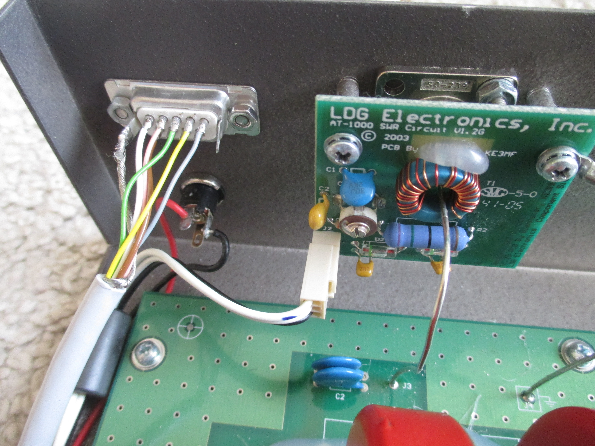

#### LDG AT-1000 Tuner
- rear connection with female DSUB9

#### Receiver box
- Arduino Uno with RF24 module

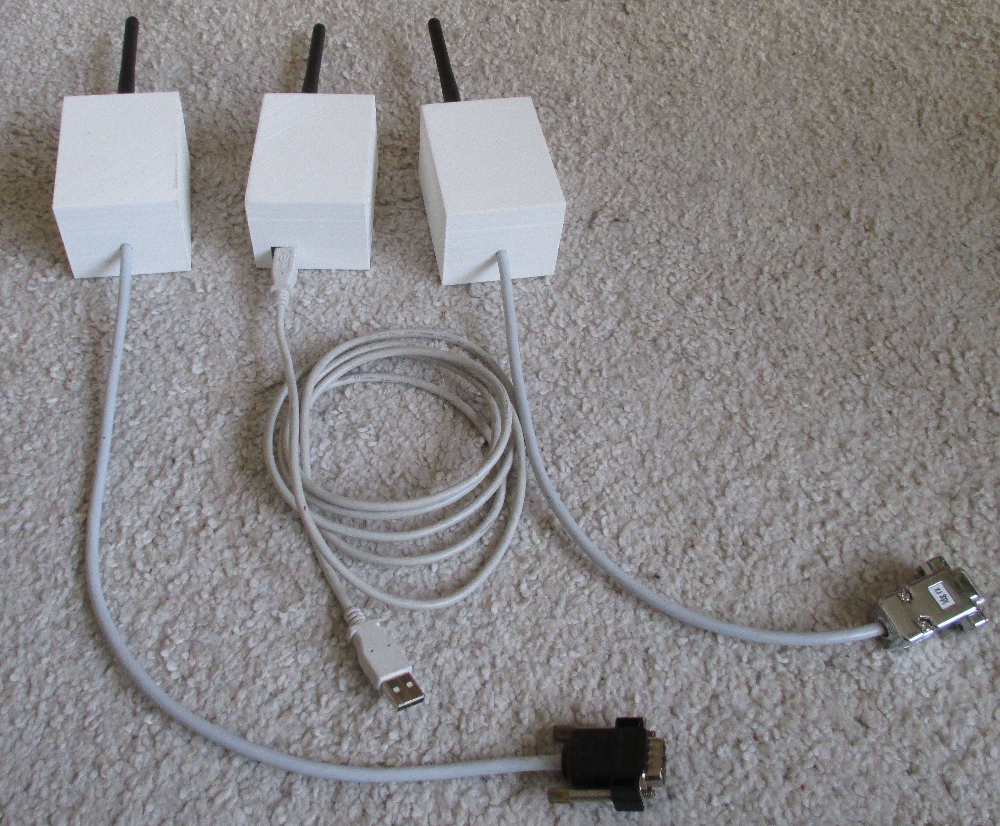

#### Receiver and transmitter boxes 
- looking very similar

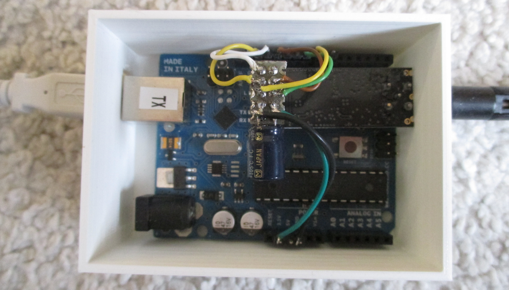

#### Transmitter box
- has USB connector for connection to a laptop pc
- can als act w/o pc (currently only for testing) 

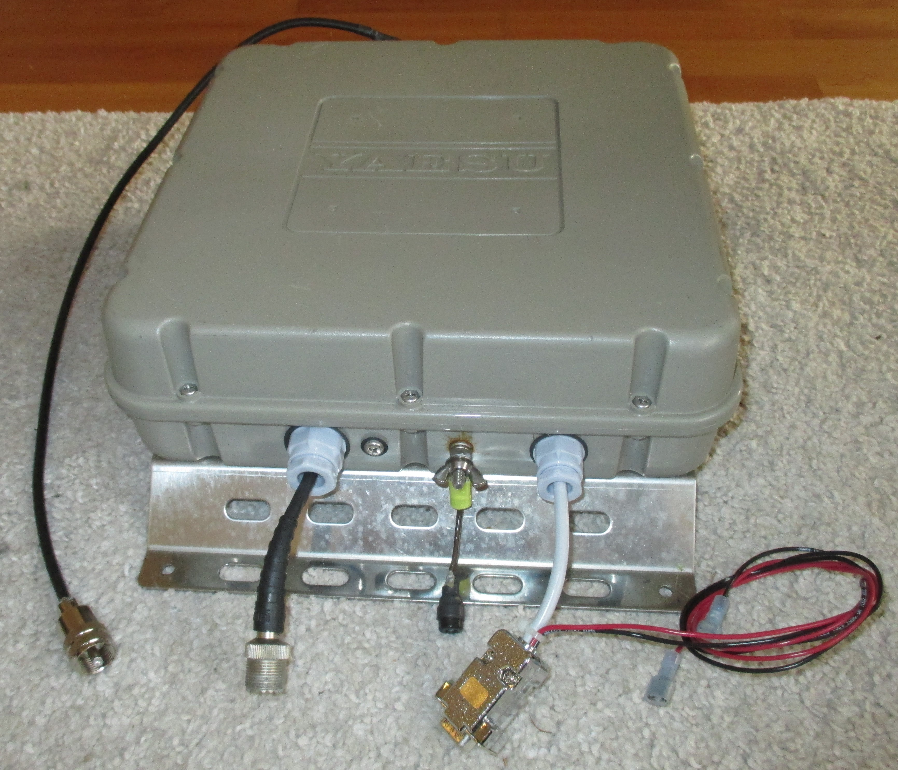

#### Yaesu FC-1000 Antenna Tuner
- top view
- housing can withstand some raindrops but is not really sealed

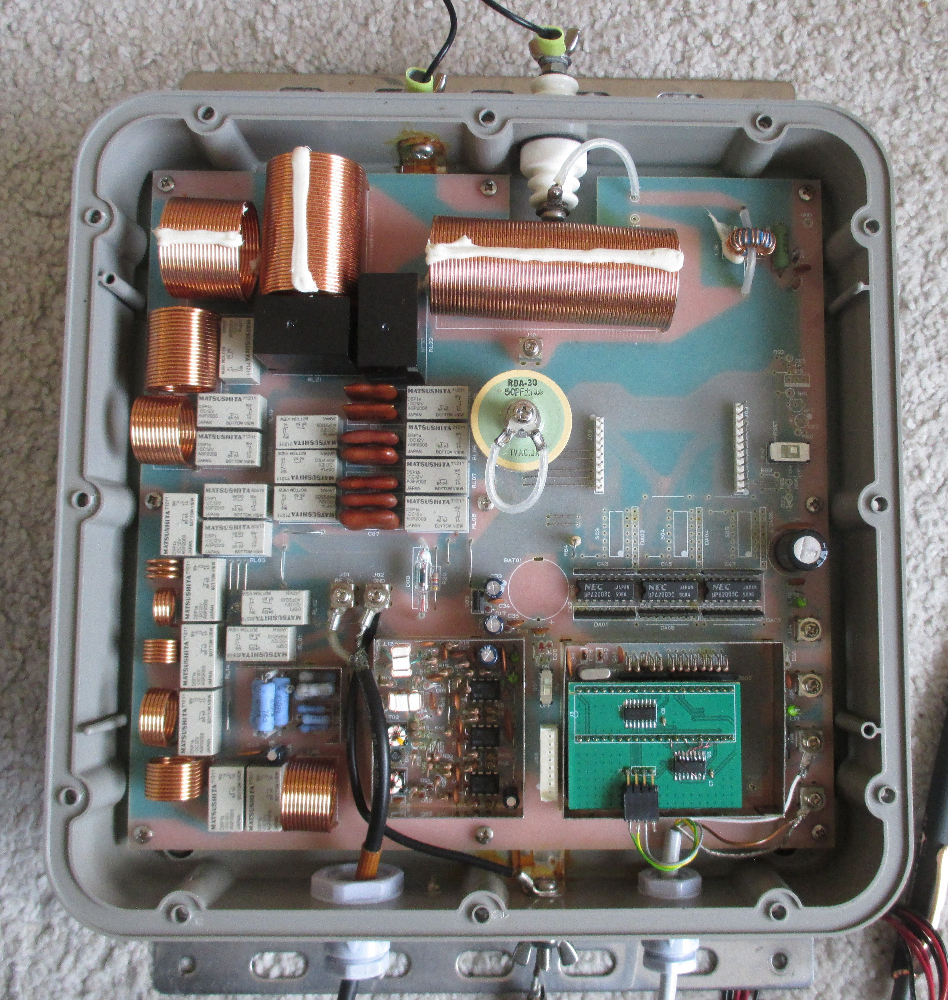

#### Yaesu FC-1000 Antenna Tuner
- top view to pcb
- nice device - 40pin controller were replaced with a small pcp (3 x HC595)

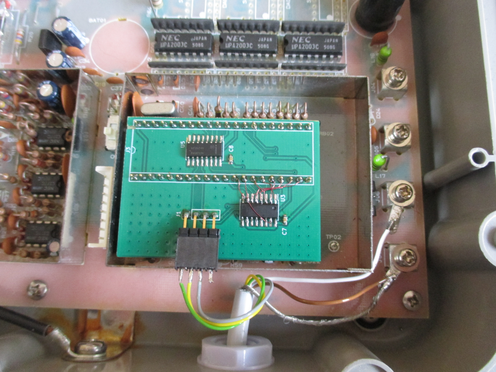

#### Yaesu FC-1000 interface board
- see wiring

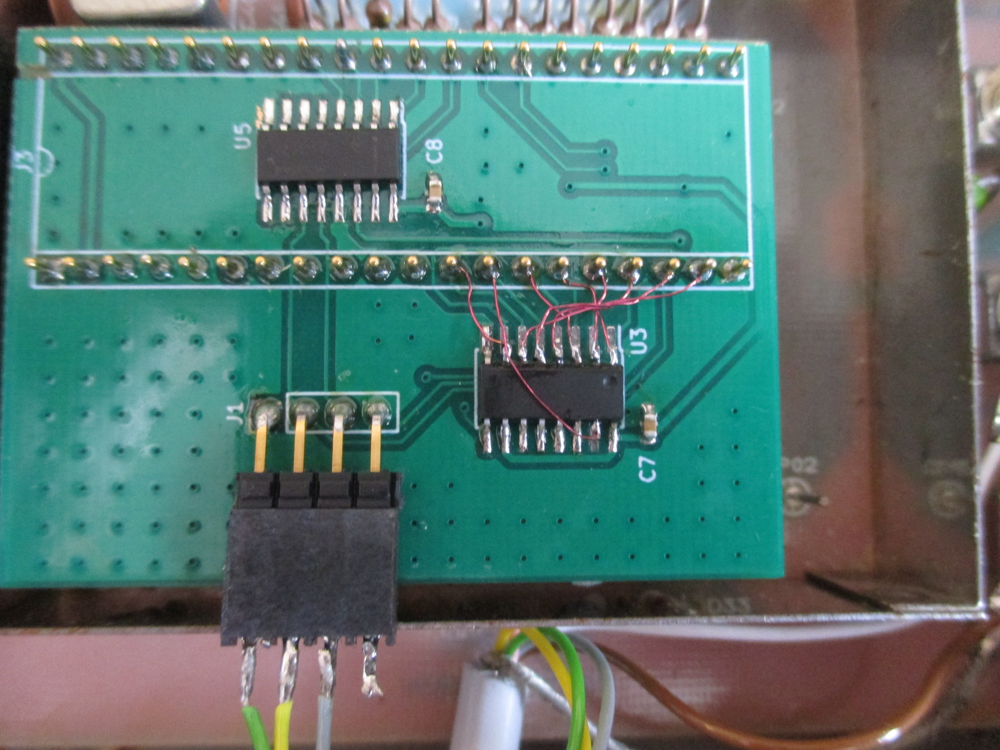

#### Yaesu FC-1000 interface board
- error was corrected with jumper wires.

